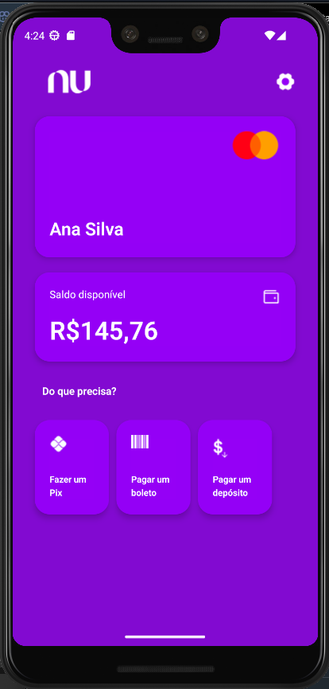

# Nubank Estilo Antigo - Frontend

Este projeto é uma aplicação mobile desenvolvida com **React Native**, **TypeScript** e **Expo**, que tem como objetivo replicar o design clássico da interface do Nubank, inspirado nas versões mais antigas do aplicativo oficial da empresa.

## 📱 Sobre

A proposta deste projeto é relembrar o estilo visual anterior do Nubank, com foco em estudos de UI e recriação de telas usando tecnologias modernas de desenvolvimento mobile.

## 🚀 Tecnologias utilizadas

- [React Native](https://reactnative.dev/)
- [TypeScript](https://www.typescriptlang.org/)
- [Expo](https://expo.dev/)

## 📷 Prévia



## 📂 Estrutura do Repositório

```plaintext
.
├── assets/
│   ├── png/
│   │   ├── boleto.png
│   │   ├── dinheiro.png
│   │   ├── logo.png
│   │   ├── mastercard.png
│   │   ├── pix.png
│   │   ├── setting.png
│   │   └── wallet.tsx
│   ├── adaptive-icon.png
│   ├── favicon.png
│   ├── icon.png
│   ├── preview.png
│   └── splash-icon.png
├── src/
│   ├── @types
│   │   ├── png.d.ts
│   │   └── svg.d.ts
│   ├── screens/
│   │   └── Home/
│   │       └── index.ts
│   └── theme/
│       └── tokens.ts
├── .gitignore
├── App.tsx
├── README.md
├── app.json
├── index.ts
├── package.json
├── tsconfig.json
└── yarn.lock
